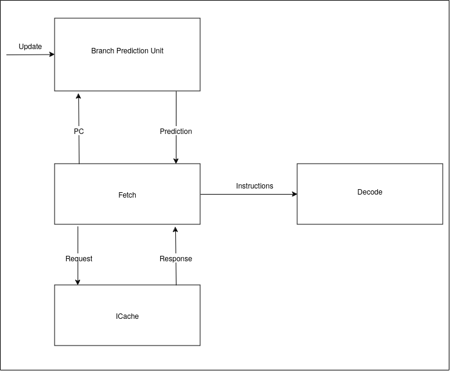

:doctitle: Design document of the Branch Prediction Unit

:toc:

[[Document_Information]]
== Document Information

This document defines the micro-architectural design and
implementation details for the Branch Prediction Unit of
the Olympia simulator

[[Revision_History]]
=== Revision History

[width="100%",cols="11%,11%,16%,62%",options="header",]
|===
|*Revision* |*Date*      |*Author*  |*Summary of Changes*
|0.2        | 2024.11.18 | Shobhit Sinha | BPU design documentation
|0.1        | 2024.11.12 | Jeff Nye | initial template
|===

[[Conventions_and_Terminology]]
=== Conventions and Terminology

[width="100%",cols="17%,83%",options="header",]
|===
|Label |Description
|BIM | A bi-modal table which stores the 2 bit counters of different branch
history patterns
|BTB| Branch target buffer
|RAS| Return address stack
|IRQ| Intermediate response queue to store the response obtained from
SimplePredictor until it is not allocated to FTQ
|FTQ| Fetch target queue to store information related to in-flight branches
which are used to update the BPU.
|===

[[Related_Documents]]
=== Related Documents

[width="100%",cols="25%,75%",options="header",]
|===
|*Title* |*Description*
| RISCV-BOOM Branch Predictor | https://docs.boom-core.org/en/latest/sections/branch-prediction/index.html
| XiangShan Branch Predictor| https://github.com/OpenXiangShan/XiangShan-doc/blob/main/docs/frontend/bp.md
|===

[[Notes_Open_Issues]]
=== Notes/Open Issues

<advisories, limitations, unsolved problems>

* Note1
* Note 2

[[OVERVIEW]]
== OVERVIEW

Branch Prediction Unit is the unit responsible for predicting the branch
outcomes and branch targets before branch instructions are actually
resolved in the pipeline in order to reduce latency between a branch and a
subsequent instruction.

It receives input in the form of FetchPC from the Fetch unit in order to
predict the target address from which Fetch unit has to get next instruction.

[[Overview_Block_Diagram]]
=== Overview Block Diagram

Figure 1 - Overview of BPU in reference to Fetch unit

[[Functional_Description]]
== Functional Description

Branch Prediction Unit in Olympia consists mainly of two parts -
First one is a simple predictor which is intended to provide a very
fast prediction, although it may not be able to correctly predict
complex branches. The second part consists of a more complex
predictor which predicts even complex branches with better accuracy.

[[Input_Ports]]
=== Input Ports

**  in_fetch_prediction_credits - To receive credits from Fetch unit to indicate availability
    of slots
**  in_fetch_prediction_req - To receive prediction requests from Fetch unit
**  TODO: input port to receive de-allocated FTQ entry once that instruction packet is committed.

[[Output_Ports]]
=== Output Ports

** out_fetch_prediction_res - To send prediction result to Fetch unit

[[Counters]]
=== Counters

** pred_req_num - Total number of prediction requests made to BPU
** num_mispred - Total number of mis-predictions
** mispred_perc - Percentage of mis-predictions

[[Unit_Block_Diagram]]
=== Unit Block Diagram

image:media/bpu_uarch.png[image,width=576,height=366]

Figure 2 - Unit block diagram of BPU

[[Block_Diagram_Description]]
=== Block Diagram Description

BPU consists of a Simple-Predictor (which is accessed in the
first fetch cycle), a more Complex-Predictor (which is also accessed
in the first fetch cycle), an IRQ (a simple queue) which stores the
response obtained from the simple-predictor, and a FTQ (a simple
queue) which stores the information of all in-flight branch instructions
and is required in order to update the BPU on mis-prediction.

[[Description_of_Simple_Predictor]]
== Description of SimplePredictor

The SimplePredictor consists of a Bi-modal table (BIM), a Branch
Target Buffer (BTB) and a Return Address Stack (RAS).

[[Operation]]
=== Operation

For every prediction request made to SimplePredictor, first a Bi-modal
table indexed by the last N global history bits is used to determine if
the branch is Taken or Not-Taken.

1. if branch is Taken
* if instruction type = branch, use BTB
* if instruction type = jump or call, use BTB
* if instruction type = ret, use RAS

2. if branch is Not-Taken
* return PC + Instruction-Width

Response of every prediction made by the SimplePredictor is stored in the
Intermediate Response Queue (IRQ).

=== C++ Class Description

Implemented as a subclass within the top level BPU class

[[Parameterization]]
=== Parameterization

1.  ghr_size  -  Maximum number of history bits stored and utilised to
index into bi-modal table.
2.  btb_queue_size - Maximum number of entries which can be allocated to
the BTB.
3.  ras_stack_size - Maximum number of entries which can be pushed to the RAS.
4.  ras_enable_overwrite - Boolean flag to set whether newer entries to
RAS on maximum capacity should overwrite or not.

[[BIM]]
=== 1. Bi-modal table

A bi-modal table which stores the 2 bit counters of different branch history patterns

[[operation]]
==== Operation

Pattern of last N history bits are used to index to the entry in the table which provides the direction
of the branch

==== C++ Class Description

Implemented as a subclass within the SimplePredictor class

Utilises a hash table

[[Branch_Target_Buffer]]
=== 2. Branch Target Buffer

Tagged entry table in which a PC is used to find a matching target.

[[operation]]
==== Operation

PC is used to index into the table, which contains the target address of the branch instruction

==== C++ Class Description

Implemented as a subclass within the SimplePredictor class

Utilizes a hash table to store target address for corresponding PC

[[Return_Address_Stack]]
=== 3. Return Address Stack

Stack used to track function calls.

[[operation]]
==== Operation

** Push the PC on the stack whenever a "call" is made
** Return the PC whenever "ret" is called and pop the entry from RAS

==== C++ Class Description

Implemented as a subclass within the SimplePredictor class

Utilizes a stack

[[Description_of_Complex_Predictor]]
== Description of ComplexPredictor

The ComplexPredictor implements a TAGE-SC-L predictor in order to predict complex branches with better
accuracy than is possible with a simple combination of BIM, BTB and RAS.

This part of the BPU only predicts the direction of the branch, and relies on
BTB or Decode stage to resolve target address.

Prediction request to the ComplexPredictor is made simultaneously with the
prediction request made to the SimplePredictor.

=== C++ Class Description

Implemented as a subclass within the top level BPU class

[[Parameterization]]
=== Parameterization

1. base_pred_table_size - Maximum number of possible entries in the base predictor
2. tage_pred_table_num - Number of prediction tables of different history lengths
3. tage_tag_width - Width of tag parameter of tagged component of TAGE
4. pred_bits
5. useful_bits

=== 1. TAGE

TAGE consists of a base predictor (a simple PC indexed 2-bit counter table), backed by
a number of tagged predictor components which uses geometrically increasing history lengths.

Each entry in a tagged component consists of a "pred" which provides the prediction, a partial "tag",
and a useful counter "u".

==== Operations

When prediction is requested, the base predictor and tagged components are accessed simultaneously.
The base predictor provides a default prediction. The tagged components provide a prediction only on
a tag match. The overall prediction is provided by the hitting tagged predictor component that uses the
longest history. In case of no matching tagged predictor component, the prediction given by default
predictor is used. [1]

==== C++ Class Description

A subclass within the ComplexPredictor class

Utilizes hash-table to store PC-indexed 2 bit branch history

Utilizes a vector of vectors to store tagged predictor component tables

=== 2. SC
TODO: Statistical Corrector is an associative table used to monitor the mis-prediction from TAGE.

=== 3. Loop Predictor
TODO: Loop predictor

[[Test_Bench_Description]]
== Test Bench Description

[[Description_of_Test_1]]
=== Basic branch prediction accuracy test

Verifies that the BPU correctly predicts simple highly biased branches

[[Description_of_Test_2]]
=== Branch prediction warm up test

On start-up, BPU takes several iterations to start predicting correctly. This test verifies
that on reset BPU is initialized properly.

[[Description_of_Test_3]]
===  Branch mis-prediction recovery test

On mis-prediction, test that BPU is updated and pipeline are flushed properly.

[[Description_of_Test_4]]
===  Dynamic branch prediction test

Tests that BPU properly predicts a mix of simple and complex branches.

[[Future_Work_or_Features]]
== Future Work or Features

<forward looking statements>

[[References_Citations]]
== References/Citations

[1] Andre Seznec, The L-TAGE Branch Predictor, 2007