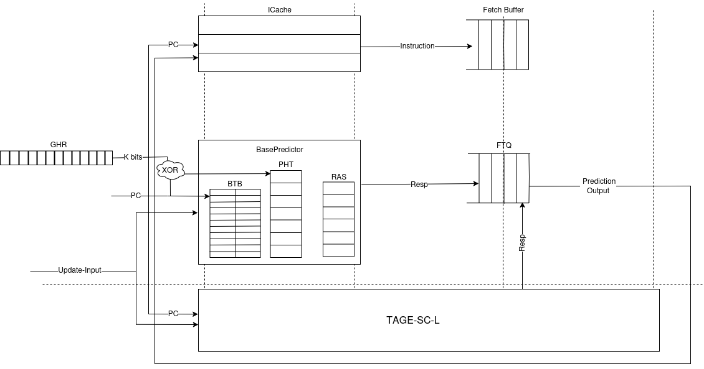
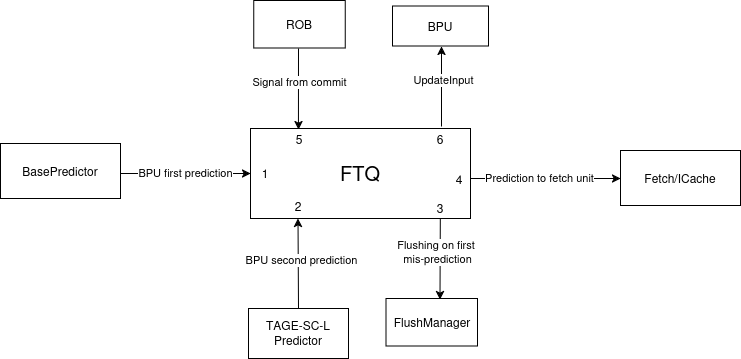

:doctitle: Design document of the Branch Prediction Unit

:toc:

[[Document_Information]]
== Document Information

This document defines the micro-architectural design and
implementation details for the Branch Prediction Unit of
the Olympia simulator.

[[Revision_History]]
=== Revision History

[width="100%",cols="11%,11%,16%,62%",options="header",]
|===
|*Revision* |*Date*      |*Author*  |*Summary of Changes*
|0.5        | 2025.03.02 | Shobhit Sinha | Added details of FTQ structure to enable prediction overriding in case of mismatch between first and second level prediction.
|0.4        | 2024.12.16 | Shobhit Sinha | Replaced BPU overview diagram with BPU interaction diagram
|0.3        | 2024.12.12 | Shobhit Sinha | Added extra ports, counters, functions list and data members to design document
|0.2        | 2024.11.18 | Shobhit Sinha | BPU design documentation
|0.1        | 2024.11.12 | Jeff Nye | initial template
|===

[[Conventions_and_Terminology]]
=== Conventions and Terminology

[width="100%",cols="17%,83%",options="header",]
|===
|Label |Description
|PHT | Pattern history table indexed by a hash of (part of) branch history and
current PC. Stores counters to predict Taken/Not-Taken
|BTB| Branch target buffer stores targetPC indexed by the current PC
|RAS| Return address stack
|FTQ| Fetch target queue stores information related to in-flight branches
which are used to update the BPU once instructions are finally committed.
|GHR| Global history register stores last several bits of branch history records.
|===

[[Related_Documents]]
=== Related Documents

[width="100%",cols="25%,75%",options="header",]
|===
|*Title* |*Description*
| RISCV-BOOM Branch Predictor | https://docs.boom-core.org/en/latest/sections/branch-prediction/index.html
| XiangShan Branch Predictor| https://github.com/OpenXiangShan/XiangShan-doc/blob/main/docs/frontend/bp.md
|===

[[OVERVIEW]]
== OVERVIEW

Branch Prediction Unit is the unit responsible for predicting the branch
outcomes and branch targets before branch instructions are actually
resolved in the pipeline. This prediction allows the processor to prefetch and execute subsequent instructions without waiting to resolve the branch condition, minimizing stalls and maintaining high throughput in the pipeline.

It receives prediction input in the form of PC and instruction type from the
Fetch unit and predicts the direction and target address from which Fetch unit
has to get the next instruction.

[[BPU_Interaction_Block_Diagram]]
=== Interaction of BPU

image:media/bpu_interaction.png[image,width=576,height=366]

Figure 1 - Overview of interaction of BPU with Fetch

[[Functional_Description]]
== Functional Description

The proposed branch prediction unit is a two-tiered branch predictor where the
first tier provides a simple but fast prediction, whereas the second tier consists
of a more accurate predictor which can predict even complex branches but takes an
additional cycle.

[[Input_Ports_BPU]]
=== Input Ports in BPU

**  `in_fetch_predictionOutput_credits` - To receive credits from Fetch unit to indicate availability of slots to send PredictionOutput to Fetch

**  `in_fetch_predictionRequest` - To receive prediction requests from Fetch unit

**  `TODO-`: input port to receive de-allocated FTQ entry once that instruction packet is committed.

[[Corresponding_output_ports]]
==== Corresponding Output Ports

** `out_bpu_predictionOutput_credits` - in Fetch.cpp. To send credits to BPU to indicate availability of slots to receive PredictionOutput.

** `out_bpu_predictionRequest` - in Fetch.cpp. To send PredictionRequest to BPU.

[[Output_Ports_BPU]]
=== Output Ports in BPU

** `out_fetch_predictionRequest_credits` - To send credits to Fetch unit to indicate availability of slots in BPU to receive PredictionRequest.

** `out_fetch_predictionOutput` - To send PredictionOutput to Fetch unit.

[[Corresponding_input_ports]]
==== Corresponding Input Ports

** `in_bpu_predictionRequest_credits` -  in Fetch.cpp. To receive credits from BPU to indicate availabilty in BPU to send PredictionRequest.

** `in_bpu_predictionOutput` - in Fetch.cpp. To receive PredictionOutput from BPU.

[[Counters]]
=== Counters

** `pred_req_num` - Total number of prediction requests made to BPU
** `num_mispred` - Total number of mis-predictions
** `mispred_perc` - Percentage of mis-predictions
** `branch_req_num` - Total number of prediction requests made which are conditional branch instructions.
** `call_req_num` - Total number of prediction requests made which are call/jump type.
** `return_req_num` - Total number of prediction requests made which are return type.
** `pht_req_num` - Total number of requests made to PHT.
** `pht_hit_num` - Total number of times when requested index is hit on PHT.
** `pht_miss_rate` - Total number of times when requested index is miss on PHT.
** `pht_mispred_perc` - Percentage of times when PHT mispredicted. 
** `btb_req_num` - Total number of requests made to BTB.
** `btb_hit_rate` - Total number of times when requested index is hit on BTB.
** `btb_miss_rate` - Total number of times when requested index is miss on BTB.
** `ras_high_mark` - Highest size of RAS during an execution cycle.
** `ras_low_mark` - Lowest size of RAS during an execution cycle.

[[Unit_Block_Diagram]]
=== Unit Block Diagram

Figure 2 - Unit block diagram of BPU

[[Block_Diagram_Description]]
=== Block Diagram Description

BPU consists of a BasePredictor (which is accessed in the
first fetch cycle), a TAGE_SC_L-Predictor (which is also accessed
in the first fetch cycle), and an FTQ (a simple
queue) which stores the information of all in-flight branch instructions
and is required in order to update the BPU once instruction are finally
committed.

[[Description_of_PredictionRequest]]
== Description of PredictionRequest

Olympia's Branch Prediction API expects the implementation of Branch Predictor to specify its implementation of a prediction input.

[[Overview_of_PredictionRequest]]
===  Overview
PredictionRequest is received by the BPU from the Fetch unit whenever a request for
the prediction is made. Based on the data provided by this input, BPU makes the
prediction.

[[Structure_of_PredictionRequest]]
===  Structure of PredictionRequest

**  Program counter
**  instruction type (branch, jump, or ret)

[[Class_Description]]
===  Class Description

==== Constructor -
`PredictionRequest(uin64_t PC, uint8_t instType) : PC_(PC), instType_(instType) {}`

=== Data members

==== Private members
**  `uint64_t PC_`
**  `uint8_t  instType_`

[[Description_of_PredictionOutput]]
== Description of PredictionOutput

Olympia's Branch Prediction API expects the implementation of Branch Predictor to specify its implementation of a prediction output.

[[Overview_of_PredictionOutput]]
===  Overview
PredictionOutput is the format in which predictions made by the BPU is sent out
to the Fetch unit.

[[Structure_of_PredictionOutput]]
===  Structure of PredictionOutput

** Prediction of direction taken by branch

** Prediction of target PC

[[Class_Description_of_PredictionOutput]]
===  Class Description of PredictionOutput

==== Constructor -
`PredictionOutput(bool predDirection, uint64_t predPC) : predDirection_(predDirection), predPC_(predPC) {}`

=== Data members

==== Private members

** `bool predDirection_`
** `uint64_t predPC_`

[[Description_of_UpdateInput]]
== Description of UpdateInput

Olympia's Branch Prediction API expects the implementation of Branch Predictor to specify its implementation of an update input.

[[Overview_of_UpdateInput]]
===  Overview

Once the instructions are committed, UpdateInput is sent to the BPU in order to
update BPU's internal state in case of mis-prediction.

[[Structure_of_UpdateInput]]
===  Structure of UpdateInput

** PC of branch instruction

** Branch actually taken or not-taken

** Corrected target address

[[Class_Description_of_UpdateInput]]
===  Class Description of UpdateInput

==== Constructor -
`UpdateInput(uin64_t instrPC, bool correctedDirection, uint64_t correctedTargetPC) : instrPC_(instrPC), 
correctedDirection_(correctedDirection), correctedTargetPC_(correctedTargetPC) {}`

=== Data members

==== Private members

** `uint64_t instrPC_`

** `bool correctedDirection_`

** `uint64_t correctedTargetPC_`

[[BPU]]
== BPU

=== Overview
This section describes the overview and description for the top level class
which bolts the Branch Prediction Unit into the Olympia simulator.

[[Parameterization_of_BPU]]
=== Parameterization of BPU
1. `ghr_size` - Maximum number of branch history bits stored in Global
History Register (GHR)
2.  `ghr_bits_for_hash` - Number of history bits from GHR used for hashing with
PC, to finally index into PHT.
3.  `pht_size` - Maximum number of entries stored in Pattern History Table.
4.  `ctr_bits` - Number of bits used by counter in PHT to make prediction.
5.  `btb_size` - Maximum number of entries which can be allocated to
the BTB.
6.  `ras_size` - Maximum number of entries which can be pushed to the RAS.
7.  `ras_enable_overwrite` - Boolean flag to set whether newer entries to
RAS on maximum capacity should overwrite or not.

8. `tage_bim_table_size` - Size of the bimodal table of TAGE
9. `tage_bim_ctr_bits` - Number of bits used to make prediction by bimodal table of TAGE.
10. `tage_tagged_table_num` - Number of tagged components in TAGE predictor

11. `logical_table_num` - Describes the number of logical tables in SC indexed with same number
of shortest history lengths

12. `loop_pred_table_size` - Defines the maximum number of possible entries in the
loop predictor table
13. `loop_pred_table_way` - Defines the Way size of the loop predictor table

[[Class_heirarchy_of_BPU]]
=== Class heirarchy 

* BPU inherits `sparta::Unit`
* BPU inherits BranchPredictorIF.hpp

[[Class_Description_of_BPU]]
===  Class Description

* Includes `PredictionRequest`, `PredictionOutput`, `UpdateInput` class.
* Includes `BasePredictor` and `TAGE_SC_L` class.

[[Data_members_of_BPU]]
=== Data members

==== Private members
* `ghr_` -  Represents the GHR.

==== Public members

* Olympia's Branch Predictpor API expects that an implementation of branch predictor must also specify the implementations of `getPrediction(const PredictionRequest &)` and `updatePredictor(const UpdateInput &)` operations

=== Function list

==== Public functions
1. `PredictionOutput getPrediction(const PredictionRequest &)`
        ** Returns the PredictionOutput based on the PredictionRequest received.

2. `void updatePredictor(const UpdateInput &)`
        ** Updates the internal state of the BasePredictor as well as the TAGE-SC-L predictor.

==== Private functions
1.   `void recievePredictionRequest()`
        **  Called whenever PredictionRequest is received on input port of BPU.
        ** Store requests in temporary input buffer to be utilised by BasePredictor and TAGE-SC-L.

2.   `void recievePredictionUpdate()`
        ** Receives UpdateInput from input port in BPU once instructions are committed.
        ** Store deallocated FTQ entries in internal buffer in order to be used by BasePredictor and TAGE-SC-L to update itself.

3.   `PredictionOutput sendPrediction()`
        ** Sends prediction to Fetch unit.
        ** Makes entry in FTQ.
        ** Later on, handle any potential prediction override between TAGE and BasePredictor.

4.   `void sendCreditsToFetch()`
        ** Send credits to Fetch unit to indicate availabilty of slots to receive prediction input.

5.   `void receiveCreditsFromFetch()`
        ** To receive credits from Fetch unit to inidcate availabilty of slots to receive prediction output.

6.   `void makePrediction()`
        ** To send incoming prediction request to BasePredictor and TAGE-SC-L to get prediction.

7.   `void updateGHRTaken()`
        ** shifts all history bits by 1 position to left, and set last bit as 1.

8.   `void updateGHRNotTaken()` 
        ** Shifts all history bits by 1 position to left, and set last bit as 0.

[[Description_of_BasePredictor]]
== BasePredictor

[[Overview_of_the_BasePredictor]]
=== Overview
The BasePredictor consists of a Pattern History Table (PHT) indexed by a GShare hash
of PC and some specific number of global branch history bits, a Branch Target
Buffer (BTB), and a Return Address Stack (RAS).

[[Operation]]
=== Operation

image:media/bpu_process_flowchart.png[image,width=800, height=366]

* If the instruction type is a "call", the current PC is pushed to the
RAS, and is also sent to the BTB. If it is a hit, then the target is
sent out. Otherwise, an entry is made to the BTB.

** If the instruction type is a "ret", then the PC is simply popped from
the RAS, and the PC is sent out.

** If the instruction type is a branch then the PC is sent simultaneously
to the BTB, BasePredictor and the TAGE_SC_L-Predictor.
*** If it is a hit on BTB, and the BasePredictor predicts a taken
branch, then the output is sent to Fetch unit
*** If it is a hit on BTB, but
*** If it is not a hit on BTB, but the BasePredictor predicts a taken
branch, then an entry is allocated to the BTB.
** Pattern History Table (PHT) is indexed by the XOR hash of the last several
bits of global history and the PC.

[[Points_to_note]]
=== Points to note

** BTB only tells the target a branch can take if branch is taken, whether the
branch is actually (predicted to be) taken is a different question.

** Direction of branch is predicted by PHT and TAGE-SC-L

[[class_description_of_BasePredictor]]
=== Class Description

==== Constructor:
`BasePredictor(uint32_t pht_size, uint8_t ctr_bits,
uint32_t btb_size, uint32_t ras_size) : pattern_history_table(pht_size, ctr_bits), branch_target_buffer(btb_size), return_address_stack(ras_size) {}`

==== Operation
** Instantiate PatternHistoryTable class with appropriate params in constructor.

** Instantiate BranchTargetBuffer class with appropriate params in constructor.

** Instantiate ReturnAddressStack class with appropriate params in constructor.

=== Data members

==== Public data members

==== Private data members

1. `PatternHistoryTable pattern_history_table_`- 
2. `BranchTargetBuffer branch_target_buffer_`
3. `ReturnAddressStack return_address_stack_`

=== Functions list

==== Public functions

==== Private functions

[[Pattern_History_Table]]
== Pattern History Table

A hashmap of n bit counters to predict direction of branches. It is indexed by a
GShare hash (XOR) of PC and some specific number of last few branch history bits.

[[operation]]
=== Operation

Whenever a PC is received by the BPU, the PC and the last several bits of global history
registers are hashed to index into the PHT. The counter at this particular index provides
the prediction that whether the branch will be taken or not.

[[class_description_of_PHT]]
=== Class description

`class PatternHistoryTable`

==== Constructor
`PatternHistoryTable(uint32_t pht_size, uint8_t ctr_bits) : pht_size_(pht_size), ctr_bits_(ctr_bits) {}`

*  Initializes all the index of PHT with 0 values

[[Data_members_of_PHT]]
=== Data members

==== Public data members
None

==== Private data members

1. `const uint32_t pht_size_`
2. `const uint8_t  ctr_bits_`
3. `const uint8_t  ctr_bits_val_`
4. `std::map<uint64_t, uint8_t> pht_`

[[Functions_list_of_PHT]]
=== Functions list

==== Public functions
1. `void incrementCounter(uint32_t idx)` - To increment counter within the set bound of ctr_bits.
2. `void decrementCounter(uint32_t idx)` - To decrement counter.
3. `uint8_t getPrediction(uint32_t idx)` - To get prediction.

==== Private functions
None

[[Branch_Target_Buffer]]
== Branch Target Buffer

Tagged entry table in which a PC is used to find a matching target.

[[operation_of_BTB]]
=== Operation

Whenever a PC is received by the BPU, it is used to index into the BTB,
which contains the target address of the next instruction.

[[class_description_of_BTB]]
=== Class description

`class BranchTargetBuffer`

==== Constructor
`BranchTargetBuffer(uint32_t btb_size) : btb_size_(btb_size) {}`

[[Data_members_of_BTB]]
=== Data members

==== Public data members
None

==== Private data members
1. `const uint32_t btb_size_`
2. `std::map <uint64_t, uint64_t> btb_`

[[BTB_Functions_List]]
=== Functions List

==== Public functions
1. `bool addEntry(uint64_t PC, uint64_t targetPC)` - allocates a BTB entry into the
BTB table

2. `bool removeEntry(uint64_t PC)` - deallocates a BTB entry corresponding to a
particular PC.

3. `bool isHit(uint64_t PC)` - returns whether there is an entry for the PC in BTB or not.

4. `uint64_t getPredictedPC(uint64_t PC)` - returns the target PC corresponding to the
PC

==== Private functions
None

[[Return_Address_Stack]]
== Return Address Stack

RAS is a small separate predictor used to predict returns.

[[Operation_of_RAS]]
=== Operation

** Push the PC on the stack whenever a "call" is made
** Return the PC whenever "ret" is called and pop the entry from RAS

[[Class_description_of_RAS]]
=== Class Description

==== Constructor
`ReturnAddressStack(uint32_t ras_size) : ras_size_(ras_size) {}`

[[Data_members_of_RAS]]
=== Data members

==== Public data members
None

==== Private data members
1. `const uint32_t ras_size_`
2. `std::stack<uint64_t> ras_`

[[RAS_Functions_List]]
=== Functions list

==== Public functions
1. `void pushAddress(uint64_t PC)` - Whenever a JAL (call) instruction is executed, the PC is
pushed to the RAS stack. If the RAS is already full, then depending on the value
of `ras_enable_overwrite` parameter, overwrite the older entry.

2. `uint64_t popAddress()` - Whenever a JALR (ret) instruction is being executed, the topmost
element of the RAS is popped and returned to the Fetch unit.

3. `uint32_t getSize()` - To get the current size of RAS.

==== Private functions
None

[[Description_of_TAGE_SC_L]]
== TAGE_SC_L

=== Overview
The second level predictor implements a TAGE-SC-L predictor in order to predict
complex branches with better accuracy than is possible with a simple combination of
PHT and RAS.

=== Class heirarchy

** Instantiate `TAGE`, `StatisticalCorrector`, and `LoopPredictor` class

=== Class description

`class Tage_SC_L`

==== Constructor
`Tage_SC_L()`

=== Data members

==== Public members

==== Private members

=== Functions list

==== Public functions

1. `uint8_t getPrediction()` -

==== Private functions

[[Description_of_TAGE]]
== TAGE

=== Overview
TAGE consists of a Bimodal table (a simple PC indexed n-bit counter table), backed by
a number of tagged predictor components which uses geometrically increasing history lengths.

Each entry in a tagged component consists of 3 fields -

    **  `pred` - represents the direction branch will take
    **  `useful`    - represents if the prediction made by same component turned out to be correct
        last time or not.
    **  `tag` - used for verifying that the entry corresponds to the current branch instruction.

image:media/TAGE.png[image,width=700,height=300]

Source: Andre Seznec, Pierre Michaud, A case for (partially) TAgged GEometric history length branch prediction

[[Operation_of_TAGE]]
=== Operation of TAGE

When prediction is requested, the Bi-Modal table (T0) and tagged components (Ti; 1 < i < M) are
accessed simultaneously. The Bi-modal table (base predictor) provides the default prediction.
Whereas the tagged components provide a prediction only on a tag match. The overall prediction is
provided by the hitting tagged predictor component that uses the longest history length. In case of
no matching tagged predictor component, the prediction given by default predictor is used. [1]

[[Parameters_of_TAGE]]
=== Parameters of TAGE
// start from here

=== Class heirarchy

** Includes `TageBIM` and `TageTaggedComponent` class.

[[Class_Description_of_TAGE]]
=== Class Description of TAGE

`class Tage`

==== Constructor
`Tage(uint16_t tage_bim_size, uint8_t tage_bim_ctr_bits,
uint16_t tage_tagged_table_num, uint8_t tagged_ctr_bits, uint8_t tage_u_bits, uint32_t min_hist_len, 
uint8_t tage_hist_alpha, uint32_t tage_max_idx_bits, uint32_t global_hist_buff_len, uint32_t global_hist_folded_buff_len, 
uint32_t useful_reset_interval)`

** Initializes an array of `TageTaggedComponent` indexed by the hash of PC and different history
lengths

=== Data members

==== Public data members

==== Private data members
1.  `uint32_t tage_bim_table_size_` - Size of bimodal table used in TAGE.
2.  `uint16_t tage_max_index_bits_` - Maximum number of bits used to index the predictor tables of TAGE.
3.  `uint16_t tage_num_components_` - Number of tagged components used in TAGE.
4.  `uint8_t  tage_bim_counter_bits_` - Number of counter bits used in bimodal table of TAGE to make prediction.
5.  `uint8_t  tage_counter_bits_` - Number of counter bits used in tagged components of TAGE to make prediction.
6. `uint8_t  tage_useful_bits_` - Number of bits used in the 'useful' component of tagged entry.

7. `uint32_t tage_global_hist_buff_len_` - Length of the global history buffer used by TAGE.
8. `uint32_t tage_folded_hist_buff_len_` - Length of the history buffer used for folded history entries.

9. `uint32_t tage_path_hist_buff_len_` - Length of the path history buffer

10. `uint32_t tage_min_hist_len_` - Minimum length of history used in TAGE.
11. `uint8_t tage_hist_alpha_` - Common ratio of geometric progression with which history length increases. 
12. `uint32_t tage_reset_useful_interval_` - Interval after which useful bits are reset.

[[Functions_list_of_TAGE]]
=== Functions list

==== Public functions
** `uint8_t predict(uint64_t ip)` - Returns the prediction from TAGE

==== Private functions

[[Bimodal_table_of_TAGE]]
== Bimodal Table of TAGE

Bimodal table of the TAGE predictor provides the base prediction for any prediction request.

[[class_description_of_TAGE_BIM]]
=== Class description

`class TageBIM`

==== Constructor
`TageBIM(uint32_t tage_bim_table_size, uint8_t tage_base_ctr_bits) : tage_bim_table_size_(tage_bim_table_size), 
tage_base_ctr_bits_(tage_base_ctr_bits) {}`

=== Data members

==== Private data members
1. `uint32_t tage_bim_table_size_` 
2. `uint8_t tage_base_ctr_bits_`
3. `std::map<uint64_t, uint8_t> Tage_Bimodal_`

==== Public data members

=== Functions list

==== Public functions
1. `void incrementCtr()`
2. `void decrementCtr()`
3. `uint8_t getPrediction(uint32_t ip)` - Returns the prediction counter of index ip

==== Private functions

[[Tagged_Component_of_TAGE]]
== Tagged Component of TAGE

Tagged components of TAGE predictor provides prediction for different history lengths.

[[class_description_of_TAGE_Tagged_Component]]
=== Class description
`class TageTaggedComponent`

==== Constructor -

`TageTaggedComponent(uint16_t Tag, uint8_t tage_ctr_bits, uint8_t tage_useful_bits) : Tag_(Tag), 
tage_ctr_bits_(tage_ctr_bits), tage_useful_bits_(tage_useful_bits) {}`

=== Data members

==== Private data members
1. `uint16_t Tag_` - used for verifying that the entry corresponds to the current branch instruction.
2. `uint8_t tage_ctr_bits_` - represents the direction branch will take
3. `uint8_t tage_useful_bits_` - Number of bits which represents useful value

==== Public data members

=== Functions list

==== Public functions

1. `void incrementCtr()` - Increment the counter bit within the set bounds
2. `void decrementCtr()` - Decrement the counter bit within the set bounds
3. `void incrementUsefulBit()`- Increment the useful bit within the set bounds
4. `void decrementUsefulBit()` - Decremet the useful bit within the set bounds

==== Private functions

== Statistical Corrector

**Input** - Prediction + (Address, History) pair

**To decide** - whether to invert the prediction or not?

Since in most cases the prediction provided by the TAGE predictor is correct,
the Statistical Corrector predictor agrees most of the time with the
TAGE predictor, therefore a relatively small Statistical Corrector
predictor performs close to an unlimited size Statistical Corrector
predictor [2].

[[Class_Description_of_SC]]
=== Class Description

==== Constructor 
`TageStatisticalCorrector(uint16_t logical_table_num) : logical_table_num_(logical_table_num) {}`

=== Data members

==== Public members

==== Private members
1. `uint16_t logical_table_num_` - 

[[Functions_list_of_SC]]
=== Functions list

==== Public functions
** `bool revertPred(uint16_t centeredPredSum, uint16_t centeredU)` - [2]

==== Private functions

[[Description_of_Loop_Predictor]]
== Loop Predictor

A loop predictor can simply identify regular loops with constant number of
iterations. The loop predictor will provide the global prediction when it
identifies the branch as a loop with a constant iteration number and when this
identification has reached a high confidence, i.e. when the loop has been
executed several times with the same number of iterations.

It uses a Loop Predictor table which is essentially a k-way set associative table
whose entries are used to predict loops.

[[Class_description_of_LoopPredictor]]
=== Class description of LoopPredictor

** constructor - `LoopPredictor(uint32_t loop_pred_table_size, uint16_t loop_pred_table_way)`

[[Class_Description_of_loop_predictor_entry]]
=== Class Description of LoopPredictorEntry

** Constructor - `LoopPredictorEntry(uint16_t past_iter, uint16_t current_iter, uint16_t tag,
uint8_t confidence, uint8_t age, bool direction)`

1. `uint16_t past_iter` - Stores the 14-bit count for the number of iterations seen in past

2. `uint16_t current_iter` - stores the 14-bit count for the number of iterations seen currently

3. `uint16_t tag` - Stores the 14-bit tag for the entry

4. `uint8_t confidence` - 2-bit counter signifying confidence in prediction

5. `uint8_t age` - 8-bit counter signifying age of entry

6. `bool direction` - Stores the direction bit

[[Functions_list_of_loop_predictor]]
=== Functions list of LoopPredictor

==== Public functions
1. `addEntry()` - 

2. `removeEntry()` - 

==== Private functions

[[Fetch_Target_Queue]]
==  Fetch Target Queue

Fetch Target Queue stores information related to in-flight branches which are used to update
the BPU, once instructions are finally committed.

* Similar to ROB, but it is decoupled from it.

* Entries are allocated to FTQ when predictions are made.

* Upon retirement of the instruction, the corresponding FTQ entry is de-allocated
and `UpdateInput` containing `correctedDirection` and `correctedTargetPC` is sent to BPU to
update BPU's internal state.

=== FTQ enable multi-level branch predictor hierarchy
The FTQ stores predicted addresses from the branch predictor, later to be consumed by the
instruction cache.

Entries stored in the FTQ can be consumed by the instruction cache while the branch predictor
accesses higher levels of its hierarchy. [3]

=== Overriding mechanism
* BasePredictor makes the prediction for every incoming branch instruction it receives and pushes
the prediction to FTQ as soon it is made.

* This prediction stored in FTQ is utilized to fetch next instruction from instruction cache
while the branch predictor accesses higher level(TAGE-SC-L) of its hierarchy.

* Once the prediction by TAGE-SC-L is made, it is compared against the prediction made by
BasePredictor, which is already stored in FTQ.

* In case the prediction made by TAGE-SC-L mismatches the prediction made by BasePredictor,
then instructions are flushed and newly created prediction is inserted to FTQ.

* Otherwise, instruction execution continues as it is.

[[Unit_Diagram_of_FTQ]]
=== Unit Diagram of FTQ

Figure: Unit block diagram of FTQ

* Port 1 -> `in_bpu_first_prediction_` - Receives prediction made by BasePredictor of BPU
* Port 2 -> `in_bpu_second_prediction_` - Receives prediction made by TAGE-SC-L of BPU
* Port 3 -> `out_ftq_prediction_` - Send PredictionOutput to FTQ
* Port 4 -> `out_bpu_update_` - Send UpdateInput to BPU to carry out any BPU state update
* Port 5 -> `in_rob_signal_` - Receives signal from ROB during commit
* Port 6 -> `TODO` - to enable flushing instructions in case of mismatch between first level and second
level prediction.

[[Class_Description_of_FTQEntry]]
=== Class Description of FTQEntry

==== Constructor - 
`FTQEntry(uint64_t targetPC, uint64_t correctedPC, bool predDirection, bool correctedDirection) : 
targetPC_(targetPC), correctedPC_(correctedPC), predDirection_(predDirection), correctedDirection_(correctedDirection) {}`

=== Data members

==== Public members

==== Private members
** `uint64_t targetPC_`

** `uint64_t correctedPC_`

** `bool predDirection_`

** `bool correctedDirection_`

=== Functions list

==== Public functions

1. `uint64_t getTargetPC()`
2. `uint64_t getCorrectedPC()`
3. `bool     getPredDirection()`
4. `bool     getCorrectedDirection()`
5. `void     setCorrectedPC()` - sets the `correctedPC_` variable
6. `void     setCorrectedDirection()` - sets the `correctedDirection_` varibale

==== Private functions

[[Class_Description_of_FTQ]]
===  Class Description of FTQ

==== Constructor
`FTQ()`

=== Data members

==== Public members

==== Private members
1. `std::vector<FTQEntry> fetch_target_queue_` - 

[[Functions_list_of_FTQ]]
=== Functions list

==== Public functions
** `addEntry(FTQEntry ftq_entry)` - adds an entry into the FTQ.
** `removeEntry(FTQEntry ftq_entry)` - removes ftq_entry from the FTQ.

==== Private functions

[[Test_Bench_Description]]
== Test Bench Descriptions

[[Description_of_Test_1]]
=== 1. Basic branch prediction accuracy test

Verifies that the BPU correctly predicts simple highly biased branches

[[Description_of_Test_2]]
=== 2. Branch prediction warm up test

On start-up, BPU takes several iterations to start predicting correctly. This test verifies
that on reset BPU is initialized properly.

[[Description_of_Test_3]]
===  3. Branch mis-prediction recovery test

On mis-prediction, test that BPU is updated and pipeline are flushed properly.

[[Description_of_Test_4]]
===  4. Dynamic branch prediction test

Tests that BPU properly predicts a mix of simple and complex branches.

[[Future_Work_or_Features]]
== Future Work or Features

Devise the mechanism to override the prediction in case of mismatch between the prediction
made by BasePredictor and TAGE_SC_L-Predictor

[[References_Citations]]
== References/Citations

[1] André Seznec, The L-TAGE Branch Predictor, 2007

[2] André Seznec, A New Case for the TAGE Branch Predictor

[3] Optimizations Enabled by a Decoupled Front-End Architecture