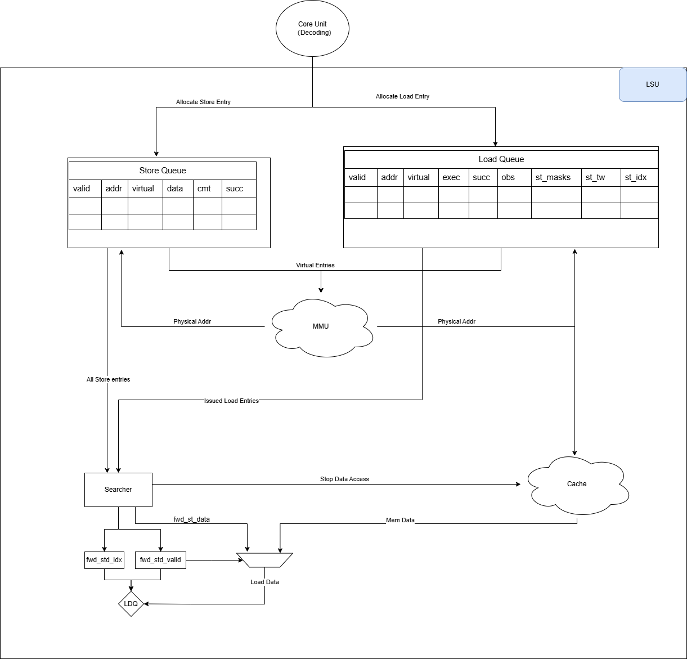

:doctitle: Olympia Load Store Unit (LSU) Design Document

:toc:

[[Document_Information]]
== Document Information

=== Revision History

[width="100%",cols="11%,11%,16%,62%",options="header",]
|===
|*Revision* |*Date*      |*Author*  |*Summary of Changes*
|0.1        | 2024.12.13 | Team     | Initial LSU design document with multi-pipeline and data forwarding
|===

=== Conventions and Terminology

[width="100%",cols="17%,83%",options="header",]
|===
|Label |Description
|LSU |Load Store Unit - Handles all memory operations
|MMU |Memory Management Unit - Handles virtual to physical address translation
|ROB |ReOrder Buffer - Ensures in-order commitment of instructions
|TLB |Translation Lookaside Buffer - Cache for virtual to physical address translations
|RAW |Read After Write hazard - Load depends on earlier store
|WAW |Write After Write hazard - Store depends on earlier store
|CSB |Committed Store Buffer - Holds retired stores waiting to write to memory
|===

=== Related Documents

[width="100%",cols="25%,75%",options="header",]
|===
|*Title* |*Description*
|The RISC-V Instruction Set Manual Volume I |Unprivileged Architecture Version 2024041
|Olympia Core Architecture |Core architecture specification
|Core Memory Model |Memory subsystem specification
|===

=== Notes/Open Issues

* Optimization of store buffer search for data forwarding
* Handling of cache bank conflicts with multiple pipelines
* Fine-tuning of pipeline stage lengths for optimal performance

== OVERVIEW

The Load Store Unit (LSU) implements the memory interface for the Olympia processor, managing all load and store operations. It features multiple parallel pipelines, data forwarding capabilities, and ensures memory consistency while maintaining high performance through careful hazard management and efficient queueing structures.

=== Overview Block Diagram

Figure 1 - LSU Block Diagram

== Functional Description

=== Unit Block Description

The LSU consists of several key functional blocks:

1. *Instruction Queues*
   - Load/Store Instruction Queue (ldst_inst_queue_)
   - Store Buffer (store_buffer_)
   - Ready Queue (ready_queue_)

2. *Pipeline Units*
   - Multiple parallel Load/Store pipelines
   - Address Generation Units
   - Data Forwarding Logic

3. *Interface Controllers*
   - MMU Interface
   - Cache Interface
   - ROB Interface

=== Key Components Detail

==== Load/Store Instruction Queue (ldst_inst_queue_)
* Size: Configurable through ldst_inst_queue_size_ parameter
* Purpose: Holds instructions from dispatch until ready for execution
* Implementation: sparta::Buffer template with LoadStoreInstInfoPtr
* Key Methods:
[source,cpp]
----
void allocateInstToIssueQueue_(const InstPtr & inst_ptr)
void popIssueQueue_(const LoadStoreInstInfoPtr & inst_ptr)
----

==== Store Buffer
* Size: Matches ldst_inst_queue_size_
* Purpose:
  - Maintains program order for stores
  - Enables store-to-load forwarding
  - Tracks uncommitted stores
* Implementation:
[source,cpp]
----
sparta::Buffer<LoadStoreInstInfoPtr> store_buffer_;
LoadStoreInstInfoPtr findYoungestMatchingStore_(const uint64_t addr) const;
----

==== Pipeline Stages

[width="100%",cols="20%,15%,65%",options="header",]
|===
|Stage |Cycles |Function
|Address Calculation |1 |Virtual address generation
|MMU Lookup |1-N |Address translation
|Cache Lookup |1-N |Cache access initiation
|Cache Read |1 |Data retrieval
|Complete |1 |Instruction completion
|===

=== Operation Flow

1. *Instruction Receipt*
   - Receives instructions from dispatch
   - Allocates queue entries
   - Begins tracking dependencies

2. *Issue Stage*
   - Checks operand readiness
   - Verifies no hazards exist
   - Selects ready instructions for execution

3. *Execution*
   - Address calculation
   - MMU interaction
   - Cache access
   - Data forwarding when applicable

4. *Completion*
   - Updates architectural state
   - Handles exceptions
   - Signals ROB for retirement

=== Data Forwarding Implementation

The data forwarding logic is implemented through the store buffer and involves:

1. *Store Buffer Search*
[source,cpp]
----
LoadStoreInstInfoPtr findYoungestMatchingStore_(const uint64_t addr) const {
    auto it = std::find_if(store_buffer_.rbegin(), store_buffer_.rend(),
                          [addr](const auto& store) {
                              return store->getInstPtr()->getTargetVAddr() == addr;
                          });
    return (it != store_buffer_.rend()) ? *it : nullptr;
}
----

2. *Forward Detection*
[source,cpp]
----
void handleCacheLookupReq_() {
    // ...
    if (!inst_ptr->isStoreInst() && allow_data_forwarding_) {
        const uint64_t load_addr = inst_ptr->getTargetVAddr();
        auto forwarding_store = findYoungestMatchingStore_(load_addr);
        if (forwarding_store) {
            mem_access_info_ptr->setDataReady(true);
            mem_access_info_ptr->setCacheState(MemoryAccessInfo::CacheState::HIT);
            return;
        }
    }
    // ...
}
----

=== Multi-Pipeline Design

The LSU implements multiple parallel pipelines through:

1. *Pipeline Configuration*
[source,cpp]
----
PARAMETER(uint32_t, num_pipelines, 2, "Number of load/store pipelines")
std::vector<LoadStorePipeline> ldst_pipelines_;
----

2. *Pipeline Management*
- Round-robin allocation
- Independent progress tracking
- Shared resource arbitration

== Test Bench Description

=== Basic Functionality Tests
* Load/Store instruction handling
* Address translation
* Data forwarding correctness
* Pipeline utilization

=== Corner Cases
* Pipeline stalls
* Exception handling
* Flush scenarios
* Resource conflicts

== Future Work

1. Enhanced store buffer search algorithms
2. Advanced pipeline scheduling
3. Improved hazard detection
4. Extended performance counters

== References

[1] RISC-V Specification
[2] Olympia Core Architecture Document
[3] Memory Consistency Model Specification