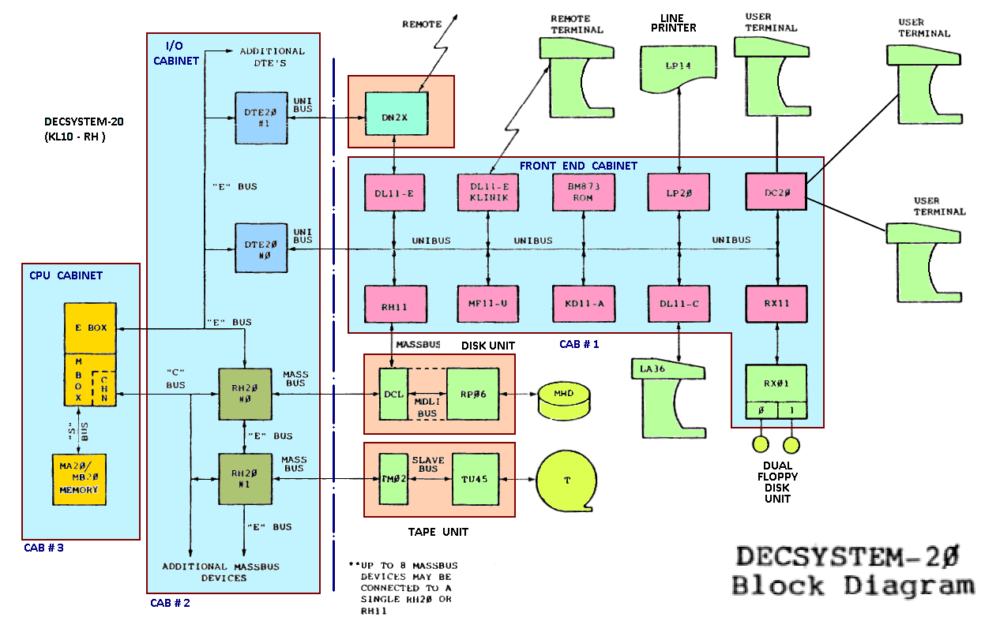

:doctitle: Olympia Design Document Template

:toc:

[[Document_Information]]
== Document Information

<meta data>

[[Revision_History]]
=== Revision History

<newest revision at the top of this table>

[width="100%",cols="11%,11%,16%,62%",options="header",]
|===
|*Revision* |*Date*      |*Author*  |*Summary of Changes*
|0.?        | 2024.11.12 | <author> | <next change>
|0.1        | 2024.11.12 | Jeff Nye | initial template
|===

[[Conventions_and_Terminology]]
=== Conventions and Terminology

<terms or acronyms used in the document that may not have general visibility>

[width="100%",cols="17%,83%",options="header",]
|===
|Label |Description
|<label> |<description
| |
|===

[[Related_Documents]]
=== Related Documents

<external documents relevant to the unit>
[width="100%",cols="25%,75%",options="header",]
|===
|*Title* |*Description*
| The RISC-V Instruction Set Manual Volume I | https://drive.google.com/file/d/1uviu1nH-tScFfgrovvFCrj7Omv8tFtkp/view?usp=drive_link[Unprivileged Architecture Version 2024041]
| | |
| | |
|===

[[Notes_Open_Issues]]
=== Notes/Open Issues

<advisories, limitations, unsolved problems>

* Note1
* Note 2

[[OVERVIEW]]
== OVERVIEW

<Overview of the unit, what does it do, where does it fit into Olympia
proper, use the section below to discuss the context>

[[Overview_Block_Diagram]]
=== Overview Block Diagram

<Add an overview block diagram>

[[Functional_Description]]
== Functional Description

<this begins the detailed description of the unit. Typically, this
discusses each major block in a separate sub-section>

[[Unit_Block_Diagram]]
=== Unit Block Diagram

<Add an overview block diagram>

Figure 1 - Sample Figure

[[Block_Diagram_Description]]
=== Block Diagram Description

<walk through the block diagram>

[[Description_of_Block_B1]]
== Description of Block <B1>

<this section contains block level details>

[[Operation]]
=== Operation

<describe the low-level operation of the block>

[[Interfaces]]
=== Interfaces

<this is typically a general list of block interfaces, this changes with
development, final design will finalize this section>

[width="100%",cols="18%,21%,61%",options="header",]
|===
|*Name* |*C++ Type* |*Purpose/Description*
| | |
| | |
| | |
|===

[[CPP_Class_Description]]
=== C++ Class Description

<describe the class, it’s inheritance assumptions and data structures
used by the class

[[Parameterization]]
=== Parameterization

<top level parameterization, include hidden and those visible in arch
yaml>

[[Test_Bench_Description]]
== Test Bench Description

<description of what is covered by the test bench, description of each
test as appropriate

[[Description_of_Test_1]]
=== Description of Test 1

<discuss test 1>

[[Description_of_Test_2]]
=== Description of Test 2

<discuss test 2>

[[Future_Work_or_Features]]
== Future Work or Features

<forward looking statements>

[[References_Citations]]
== References/Citations

<Add references as needed>

[1] <insert citation>

[[Appendices]]
== Appendices

<as needed>

[[Appendix_1]]
=== Appendix 1

<as needed>
