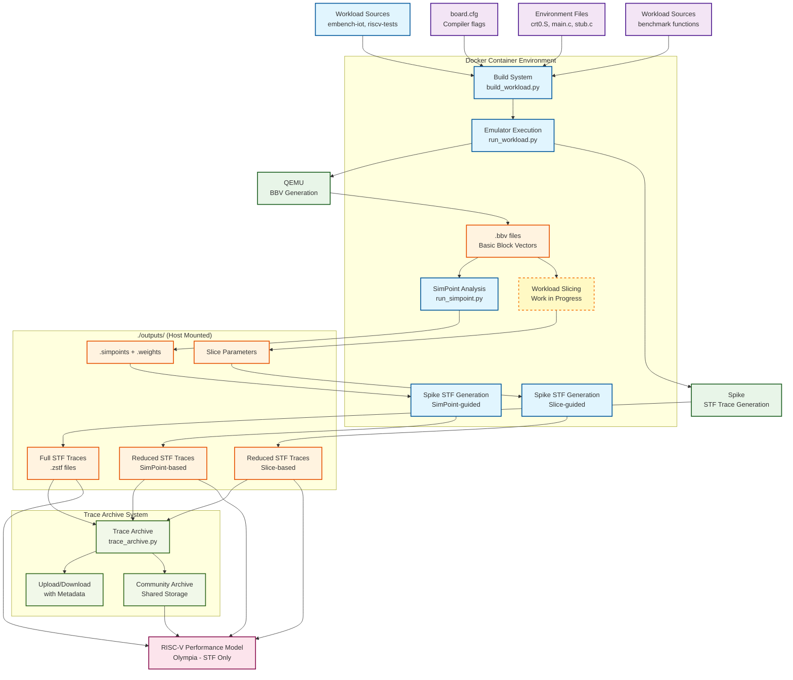

# RISC-V Workload Analysis System

A unified system for building and running RISC-V benchmarks with Spike and QEMU emulators, providing seamless switching between emulators and comprehensive trace generation for performance modeling.

## Table of Contents

- [Overview](#overview)
- [Workflow](#workflow)
- [Primary Developments](#primary-developments)
- [Quick Start](#quick-start)
- [Configuration System](#configuration-system)
- [Command Examples](#command-examples)
- [Results Structure](#results-structure)
- [Environment Structure](#environment-structure)
- [Performance Comparison](#performance-comparison)
- [Documentation](#documentation)

## Overview

This system provides a unified way to use QEMU and Spike emulators seamlessly. You can switch between emulators effortlessly while maintaining consistent build and analysis workflows. The primary flow generates basic block vectors (BBV) using either emulator, which are then processed through SimPoint analysis to create reduced traces. These reduced traces are subsequently analyzed using the RISC-V performance model.

A Docker-based approach was chosen to increase reproducibility across the community, enabling distributed trace generation and performance analysis of RISC-V models efficiently.

The toolchain uses [riscv-gnu-toolchain](https://github.com/riscv-collab/riscv-gnu-toolchain/releases) with newlib, allowing baremetal workloads to be compiled seamlessly. Additional toolchains are available (see `get-tool.sh`) and are located in `/opt/riscv/`.

## Workflow



Dependencies:
- `board.cfg` files define compiler flags and source files
- Environment files provide runtime support (crt0.S, main.c, stub.c)
- Workload-specific sources with benchmark functions
- Docker containers provide consistent build environment


## Current Development Roadmap:

**Work to be done to add flow for:**
- Workload reduction through checkpoint-based slicing (e.g., functional warming, live-cache checkpoints, time-based sampling)
- Workload reduction through SimPoint analysis results
- Add visualizations for clustering results if required to understand the projection and clusters
- Combine with the flow to generate trace metadata and upload to common trace archive
- Combine with the flow to interact with trace archive and run traces on Olympia

**Additional enhancements:**
- Add support for real world workloads (CoreMark, SPEC etc.)
## Primary Developments

**Config-driven approach** - No hardcoded compiler flags, everything configured through `board.cfg` files, easier to configure build time flags.
**Persistent outputs** - Results saved to `./outputs/` and persist after container exit  
**Runtime mounting** - Scripts mounted at runtime, to allow access from host device
**Modular design** - Easy addition of new workloads and boards
**Logging to allow Debugging** - Logs the commands executed in the flow to reproduce and understand errors.


## Quick Start

### 1. Build Docker Image
```bash
docker build -t riscv-perf-model:latest .
```

### 2. Interactive Workflow
```bash
./full_flow.py
```

This provides an interactive interface allowing seamless workflow management.

### 3. Interactive Container Access
```bash
# Option 1: Helper script
./run_interactive.sh

# Option 2: Manual command
docker run --rm -it \
    -v "$(pwd)/outputs:/outputs" \
    -v "$(pwd):/flow" \
    -v "$(pwd)/environment:/workloads/environment" \
    -v "$(pwd)/../workloads:/workloads" \
    -w /flow \
    riscv-perf-model:latest bash
```

### 4. Results Structure
```
./outputs/
├── spike_output/              # Spike execution results
│   ├── results.txt           # Timing and code size summary
│   ├── logs/                 # Execution logs per workload
│   │   ├── md5sum.log
│   │   └── slre.log
│   ├── bbv/                  # Basic Block Vector files
│   │   ├── md5sum.bbv_cpu0   # BBV data for SimPoint
│   │   └── slre.bbv_cpu0
│   └── traces/               # STF trace files (detailed)
│       ├── md5sum.zstf       # Compressed STF traces
│       └── slre.zstf
├── qemu_output/              # QEMU execution results  
│   ├── results.txt
│   ├── logs/
│   ├── bbv/                  # BBV files from plugin
│   │   ├── md5sum_bbv.0.bb
│   │   └── slre_bbv.0.bb
│   └── traces/               # Assembly traces (basic)
│       ├── md5sum_trace.log  # Simple assembly output
│       └── slre_trace.log
└── simpoint_output/          # SimPoint analysis results
    ├── md5sum.simpoints      # Representative intervals
    ├── md5sum.weights        # Interval weights  
    └── analysis_summary.json # Complete workflow summary
```

## Configuration System

### Board Configuration Files
Located in `environment/{board}/board.cfg`, using space-separated values:

```ini
[DEFAULT]
board = spike
cc = riscv32-unknown-elf-gcc
defines = SPIKE=1 CPU_MHZ=1

[rv32.baremetal]
base_cflags = -march=rv32imafdc -mabi=ilp32d -mcmodel=medany
base_ldflags = -march=rv32imafdc -mabi=ilp32d -nostartfiles
libs = -lc -lm

[embench-iot]
workload_cflags = -Dtrue=1 -Dfalse=0
environment_files = crt0.S main.c stub.c util.c

[riscv-tests]  
workload_cflags = -std=gnu99 -Wno-implicit-int
environment_files = crt0.S main.c stub.c util.c
```

Compiler flags can be changed by editing `/workloads/environment/{qemu,spike}/board.cfg` files. This allows defining specific compiler flags for any workload, source files, and header files, enabling cleaner addition of new workloads without hardcoding compiler options.

### Adding New Workloads

Simply add a configuration section:
```ini
[my-benchmark]
workload_cflags = -O3 -funroll-loops
environment_files = crt0.S main.c stub.c util.c
```

Goal here is to get easier additions of newer workloads by adding their compilation settings.

## Command Examples

### Interactive Mode
```bash
python3 full_flow.py
```

### Direct Script Usage

It is required to build your workload with `--bbv` and `--trace` if generating BBV and traces on spike (See [doc/bbv-trace](doc/bbv-trace))


```bash
# Build Embench Workload with instrumentation for BBV generation and Trace
python3 build_workload.py --workload embench-iot --board spike --arch rv32 --bbv --trace

# Run the compiled Embench workload on spike with BBV and Trace generation 
python3 run_workload.py --emulator spike --arch rv32 --bbv --trace
```

## Environment Structure

Essential files providing the baremetal runtime:
```
environment/{board}/
├── board.cfg    # Configuration (space-separated flags, sources)
├── main.c       # Unified main with board support
├── crt0.S       # Startup assembly providing _start
├── link.ld      # Linker script for memory layout
├── stub.c       # Newlib stubs for baremetal compilation
└── util.c       # Board-specific utilities (HTIF/test device)
```

The `_start` symbol in crt0.S sets up the baremetal environment, then calls `env_main` which invokes benchmark functions. These functions are designed to be overwritten by the benchmarks being linked. The stub.c provides stub implementations so newlib compiles seamlessly for baremetal workloads.

## Performance Comparison

Recent benchmarking results show QEMU performance advantages:

### Normal Mode
```
Total Spike time: 1.186s  
Total QEMU time: 0.954s
QEMU advantage: 1.24x faster
```

### BBV Mode  
```
Total Spike time: 2.699s
Total QEMU time: 0.998s  
QEMU advantage: 2.70x faster
```

More in [doc/emulator-comparison](doc/emulator-comparison)


### STF Trace Generation

Read the [generate trace](generate_trace.md) file for details.

## Documentation

- [doc/emulator-comparison.md](doc/emulator-comparison.md) - Detailed Spike vs QEMU comparison
- [doc/adding-workloads.md](doc/adding-workloads.md) - Guide for integrating new benchmark suites  
- [doc/bbv-trace.md](doc/bbv-trace.md) - BBV generation and trace integration details

Code runs inside Docker containers with results stored in the `./outputs/` folder, mounted to `/outputs` in the container. This provides reproducibility and convenience without requiring the Docker container environment for result access.