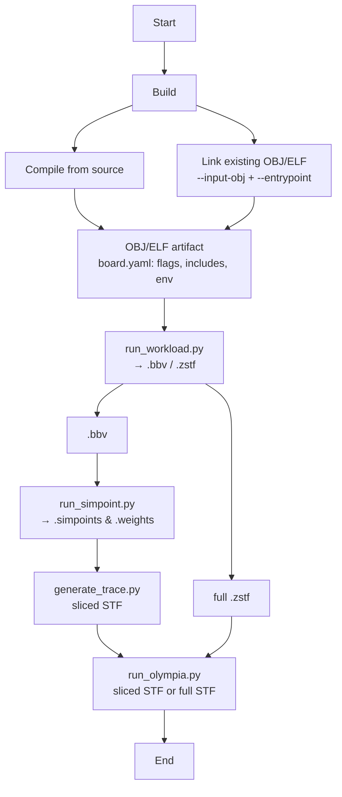

# RISC-V Workload Analysis System

A unified system for building and running RISC-V benchmarks with Spike and QEMU emulators, providing seamless switching between emulators and comprehensive trace generation for performance model

Reproducability is the goal. 
Along with a trace archive which records information such as:
  - binary hash, STF Trace, Simpointed Traces...


## Table of Contents

- [Overview](#overview)
- [Workflow](#workflow)
- [Primary Developments](#primary-developments)
- [Quick Start](#quick-start)
- [Configuration System](#configuration-system)
- [Command Examples](#command-examples)
- [Results Structure](#results-structure)
- [Environment Structure](#environment-structure)
- [Performance Comparison](#performance-comparison)
- [Documentation](#documentation)

## Overview

This system provides a unified way to use QEMU and Spike emulators seamlessly. You can switch between emulators effortlessly while maintaining consistent build and analysis workflows. The primary flow generates basic block vectors (BBV) using either emulator, which are then processed through SimPoint analysis to create reduced traces. These reduced traces are subsequently analyzed using the RISC-V performance model.

A Docker-based approach was chosen to increase reproducibility across the community, enabling distributed trace generation and performance analysis of RISC-V models efficiently.

The toolchain uses [riscv-gnu-toolchain](https://github.com/riscv-collab/riscv-gnu-toolchain/releases) with newlib, allowing baremetal workloads to be compiled seamlessly. Additional toolchains are available (see `get-tool.sh`) and are located in `/opt/riscv/`.

## Workflow



Dependencies:
- `board.yaml` files define compiler flags and source files
- Environment files provide runtime support (crt0.S, main.c, stub.c)
- Workload-specific sources with benchmark functions
- Docker containers provide consistent build environment

## Quick Start

### 1. Build Docker Image
```bash
git clone https://github.com/Jatin-exe/riscv-perf-model.git
cd traces/docker_stf_trace_gen
docker build -t riscv-perf-model:olympia .
```

### 2. End to End flow
```bash
./full_flow.py --workload embench-iot --emulator spike --arch rv32 --platform baremetal --bbv --trace --simpoint --interval-size 10000 --slice --benchmark matmult-int
```
Interactive mode asks all settings up-front (workload vs wrapper-link, emulator, arch, platform, BBV/trace/simpoint/sliced vs full-trace, Olympia), then runs the selected pipeline end-to-end.

### 3. Interactive Container Access
```bash
# Option 1: Helper script, mounts the output to the host for easy access.
./run_interactive.sh
```


### Mounts and Directories
- `/flow`: your repo (scripts live here)
- `/default/environment`: minimal baremetal board environment (crt0.S, main.c, stub.c, util.c, link.ld)
- `/default`: default workload suites in the image (e.g., `/default/embench-iot`, `/default/riscv-tests`)
- `/workloads`: optional host-provided workload mount (if present)
- `/outputs`: all outputs (build artifacts, BBV, SimPoint, slices, Olympia reports)
  - Built binaries: `/outputs/<emulator>/bin/<workload>/<benchmark>/<benchmark>`
  - Run outputs: `/outputs/<emulator>/<workload>/<benchmark>/{bbv,traces,logs}`
  - SimPoint: `/outputs/simpoint_analysis/<bench>.{simpoints,weights}`
  - Sliced STF: `/outputs/simpointed/<emulator>/<workload>/<benchmark>/*.zstf`
  - Olympia: `/outputs/olympia_reports/<emulator>/<workload>/<benchmark>/*`

### 4. Results & Logs Structure
```
./outputs/
├── spike/                    # Spike execution results
│   └── embench-iot/
│       └── md5sum/
│           ├── bbv/md5sum.bbv
│           ├── traces/md5sum.zstf
│           └── logs/  # emulator stdout/stderr are captured here
├── qemu/                     # QEMU execution results
│   └── riscv-tests/
│       └── dhrystone/
│           ├── bbv/dhrystone.bbv.0.bb
│           └── logs/
├── olympia_reports/          # Olympia reports from STF traces
│   ├── md5sum.txt
│   └── slre.txt
└── spike/                    # Built artifacts (per-emulator bin under each)
    └── bin/embench-iot/md5sum/
        ├── obj/*.o
        └── md5sum            # Executable
```


## Primary Developments

**Config-driven approach** - No hardcoded compiler flags, everything configured through `board.yaml` files, easier to configure build time flags.
**Persistent outputs** - Results saved to `./outputs/` and persist after container exit  
**Runtime mounting** - Scripts mounted at runtime, to allow access from host device
**Modular design** - Easy addition of new workloads and boards
**Logging to allow Debugging** - Logs the commands executed in the flow to reproduce and understand errors.


## Workloads: Default vs Custom

- Default suites are baked into the image under `/default`: `embench-iot`, `riscv-tests`, `dhrystone`.
- Custom suites on the host can be placed under `./workloads` and will mount to `/workloads` in the container.
- Build always prefers `/workloads/<suite>` when present, else falls back to `/default/<suite>`.

## Configuration System

### Board Configuration Files
Located in `environment/{board}/board.yaml`, using hierarchical YAML:

```yaml
board: spike
defaults:
  cc: riscv32-unknown-elf-gcc
  defines: ["CPU_MHZ=1", "WARMUP_HEAT=1"]
architectures:
  rv32:
    platforms:
      baremetal:
        cc: riscv32-unknown-elf-gcc
        arch: rv32imafdc
        abi: ilp32d
        base_cflags: ["-march=rv32imafdc", "-mabi=ilp32d", "-mcmodel=medany", "-mno-relax", "-mstrict-align"]
        base_ldflags: ["-march=rv32imafdc", "-mabi=ilp32d", "-nostartfiles", "-Wl,--no-warn-rwx-segments"]
workloads:
  embench-iot:
    workload_cflags: ["-Dtrue=1", "-Dfalse=0"]
    platforms:
      baremetal:
        environment_files: ["crt0.S", "main.c", "stub.c", "util.c"]
features:
  bbv:
    bbv_cflags: ["-DBBV"]
  trace:
    trace_cflags: ["-DTRACE"]
```

Compiler flags and ISA are derived from these YAML configs at build/run time.

### Adding New Workloads

Simply add a configuration section:
```ini
[my-benchmark]
workload_cflags = -O3 -funroll-loops
environment_files = crt0.S main.c stub.c util.c
```

Goal here is to get easier additions of newer workloads by adding their compilation settings.

## Using Precompiled Binaries or Objects

Option A: Run an existing ELF directly

```bash
python3 flow/run_workload.py --emulator spike --arch rv32 --platform baremetal \
  --binary /path/to/your.elf --bbv --interval-size 10000
```

Option B: Link objects with environment wrapper and a custom entrypoint

```bash
python3 flow/build_workload.py --input-obj your.o another.o --entrypoint your_main \
  --arch rv32 --platform baremetal --emulator spike
# Then run the produced binary under /outputs/<emu>/bin/custom/<name>/<name>
python3 flow/run_workload.py --emulator spike --arch rv32 --platform baremetal \
  --binary /outputs/spike/bin/custom/<name>/<name> --bbv --interval-size 10000
```

The runner discovers binaries under `/outputs/<emulator>/bin` and generates outputs under `/outputs/<emulator>/<workload>/<benchmark>/`.

## Command Examples

### Interactive Mode
```bash
python3 full_flow.py
```

### Direct Script Usage

Build with `--bbv` and/or `--trace` to enable instrumentation. Spike produces STF `.zstf` traces. QEMU can produce STF via plugin.

```bash
# Build Embench workload for Spike w/ BBV + STF trace
python3 flow/build_workload.py --workload embench-iot --emulator spike --arch rv32 --bbv --trace

# Run on Spike, generate BBV + STF
python3 flow/run_workload.py --emulator spike --arch rv32 --workload embench-iot --bbv --trace --clean

# Run on QEMU, generate BBV and STF via plugin (configurable num instructions)
python3 flow/run_workload.py --emulator qemu --arch rv64 --workload riscv-tests --bbv --trace \
  --trace-num-instructions 2000000 --trace-start-instruction 0
```

Important: BBV Interval Size
- The BBV interval size (`--interval-size`) sets SimPoint windowing for BBV collection on Spike and QEMU.
- If the workload is very small and the interval size is very large, the BBV file can end up empty (no full windows observed). Reduce interval size.
- For testing SimPoint end-to-end, use a small interval like `--interval-size 10000` to ensure BBV and SimPoint outputs are generated quickly.

## Environment Structure

Essential files providing the baremetal runtime:
```
environment/{board}/
├── board.yaml   # Configuration (YAML, flags, sources)
├── main.c       # Unified main with board support
├── crt0.S       # Startup assembly providing _start
├── link.ld      # Linker script for memory layout
├── stub.c       # Newlib stubs for baremetal compilation
└── util.c       # Board-specific utilities (HTIF/test device)
```

The `_start` symbol in crt0.S sets up the baremetal environment, then calls `env_main` which invokes benchmark functions. These functions are designed to be overwritten by the benchmarks being linked. The stub.c provides stub implementations so newlib compiles seamlessly for baremetal workloads.

## CLI Arguments

- flow/build_workload.py
  - `--workload`: suite (embench-iot | riscv-tests | dhrystone)
  - `--emulator`: spike | qemu
  - `--arch`: rv32 | rv64
  - `--platform`: baremetal | linux
  - `--benchmark`: build only a specific benchmark (optional)
  - `--bbv`, `--trace`: add instrumentation
  - DEBUG=1 prints parsed config (cc/cflags/ldflags)

- flow/run_workload.py
  - `--emulator`: spike | qemu
  - `--arch`, `--platform`
  - `--workload`: suite
  - `--benchmark`: specific benchmark (optional; if omitted, runs all)
  - `--bbv`, `--trace`, `--interval-size`
  - `--trace-num-instructions`, `--trace-start-instruction` (QEMU STF plugin)

- flow/run_simpoint.py
  - `--emulator`: spike | qemu
  - `--workload`: suite
  - `--max-k`: SimPoint K

## Performance Comparison

Recent benchmarking results show QEMU performance advantages:

### Normal Mode
```
Total Spike time: 1.186s  
Total QEMU time: 0.954s
QEMU advantage: 1.24x faster
```

### BBV Mode  
```
Total Spike time: 2.699s
Total QEMU time: 0.998s  
QEMU advantage: 2.70x faster
```

More in [doc/emulator-comparison](doc/emulator-comparison)


### Trace Generation
- Spike: Detailed STF (`.zstf`) via `--stf_macro_tracing`.
- QEMU: STF via plugin (`/usr/lib/libstfmem.so`) using dyn_insn_count mode; configurable with `--trace-num-instructions` and `--trace-start-instruction`.

Olympia (riscv-perf-model) is built into the image and exposed as `olympia`.

Generate STF (sliced or full) inside the container:

Inside the container, prefer the container-native generator (uses `/outputs` state):
```
# SimPoint-sliced STF for Spike; auto-reads interval_size from run_meta.json
python3 flow/generate_trace.py --emulator spike --workload embench-iot --benchmark aha-mont64 --sliced --verify --dump --clean

# One-shot slice of N instructions (Spike or QEMU) starting at 0
python3 flow/generate_trace.py --emulator spike --workload embench-iot --benchmark aha-mont64 --interval-size 2000000 --clean

# Run Olympia on sliced traces
python3 flow/run_olympia.py --dir /outputs/simpointed/spike/embench-iot/aha-mont64 --interval 10000 --clean
```

## Current Development Roadmap:

**Work to be done to add flow for:**
- Add visualizations for clustering results if required to understand the projection and clusters
- Combine with the flow to generate trace metadata and upload to common trace archive
- Combine with the flow to interact with trace archive and run traces on Olympia

**Additional enhancements:**
- Add support for real world workloads (CoreMark, SPEC etc.)


## Documentation

- [doc/emulator-comparison.md](doc/emulator-comparison.md) - Detailed Spike vs QEMU comparison
- [doc/adding-workloads.md](doc/adding-workloads.md) - Guide for integrating new benchmark suites  
- [doc/bbv-trace.md](doc/bbv-trace.md) - BBV generation and trace integration details

Code runs inside Docker containers with results stored in the `./outputs/` folder, mounted to `/outputs` in the container. This provides reproducibility and convenience without requiring the Docker container environment for result access.
